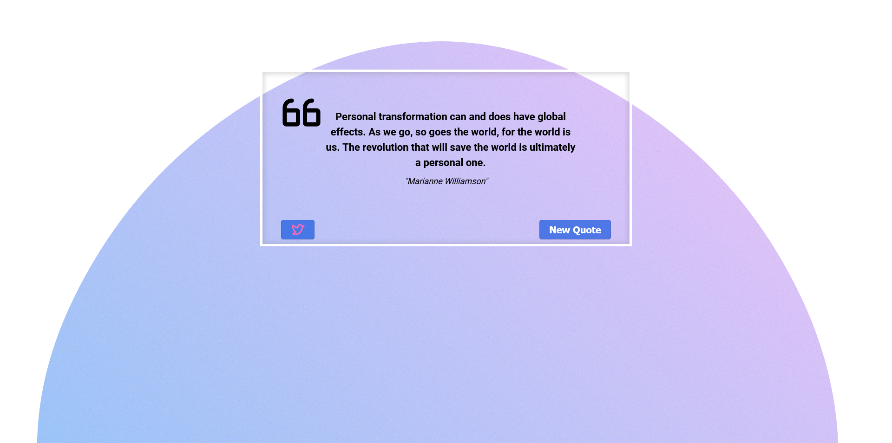

The [Quote Generator](https://farhdibehnamdev.github.io/Quote-Generator/) is designed to practice and explore HTML and CSS , JavaScript.

The template is a guide meant for you to explore and change to ✨*make it your own*✨

## Table of contents

- [Overview](#overview)
  - [So how do I use this?](#So-how-do-I-use-this)
  - [The challenge](#the-challenge)
  - [Screenshot](#screenshot)
  - [Links](#links)
- [My process](#my-process)
  - [Built with](#built-with)
  - [helpful resources](#helpful-resources)
- [Created a masterpiece? 🎨 Share it!](#Created-a-masterpiece)

## So how do I use this?

1. Download the files ⬇️
2. Open in a text editor of your choice and change the place holder content to your hearts content 💛
3. Of course, I have used Visual Studio Code.

### The challenge

Users should be able to:

- You can generate a new quote by clicking on the "new quote" button.
- Click on the tweet button to share a quote.
- If the quote is not ready, users will see a spinner.

### Screenshot

### Links

- Live Site URL: [Quote Generator](https://farhdibehnamdev.github.io/Quote-Generator/)

## My process

### Built with

- Semantic HTML5 markup
- Flexbox
- JavaScript
- Fetch API

## helpful resources

#### Fonts

- [Google Fonts](https://fonts.google.com/specimen/Roboto)

#### Icons

- [Phosphor Icons](https://phosphoricons.com/)

#### CSS

- [Mozilla Developer Network: Beginners Guide to CSS](https://developer.mozilla.org/en-US/docs/Learn/CSS/Introduction_to_CSS)
- [Mozilla Developer Network: JavaScript Guide](https://developer.mozilla.org/en-US/docs/Web/JavaScript/Guide)

## Created a masterpiece? 🎨 Share it!

If so, please fork this repo and add a link to this README.md or create an issue with the github page link and to have it added to the README.md.
